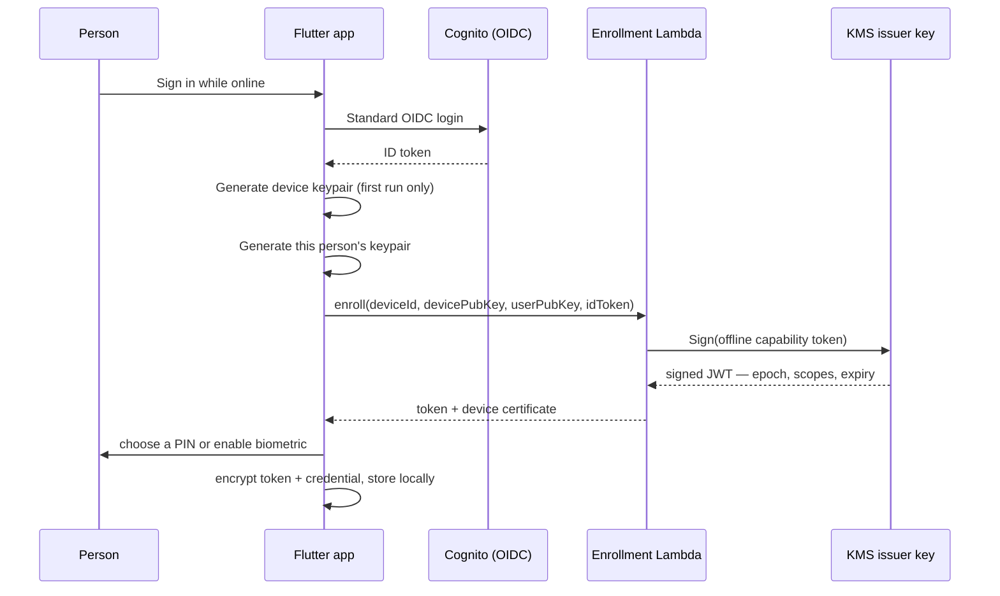

# Enrollment Flow

This is the only part of the system that needs a network. Everything provisioned here is what makes every later sign-in work without one.

## Steps in Detail

1. **Standard OIDC login.** This is the one moment the app behaves like any other app — Cognito confirms who the person actually is. Nothing offline-specific happens yet.
2. **Device keypair generation (first run only).** One per physical device, ECDSA P-256, generated in the platform Keystore/Keychain where available. Ties every future token to *this* hardware — see [[../Security/Trust Anchors|Trust Anchors]].
3. **Per-user keypair generation.** One per enrolled person on this device. Only the public half is ever sent to the server.
4. **The enrollment call.** Sends both public keys and the freshly-obtained ID token to the Enrollment Lambda.
5. **Token signing.** The Lambda asks KMS to sign an offline capability token — a short-lived JWT carrying `user_id`, `device_id`, `scopes`, `epoch`, and an expiry (typically 24–72 hours out). The private signing key never leaves KMS; see [[../Security/Trust Anchors|Trust Anchors]].
6. **Local factor setup.** The person chooses a PIN or enables biometric unlock for *this profile on this device* — not an OS account, an app-level local factor.
7. **Encrypted local storage.** The token and the per-user credential are encrypted and stored, wrapped by a key that only the correct local factor can unlock.

## What This Produces

By the end of enrollment, the device holds everything [[Offline Sign-In Flow]] needs, and nothing more:
- A signed, time-bounded token proving this person was verified online, recently
- A local credential only that person's PIN/biometric can unlock
- No standing network dependency for any future sign-in within the token's validity window

## Refresh

The same call happens again, silently, whenever the device is online and the app is foregrounded — see [[../Security/Token Lifecycle and Revocation|Token Lifecycle and Revocation]] for when this matters (and when it doesn't, because the device never reconnects in time).

## See Also

- [[Architecture Index]]
- [[Offline Sign-In Flow]]
- [[../Security/Trust Anchors|Trust Anchors]]
