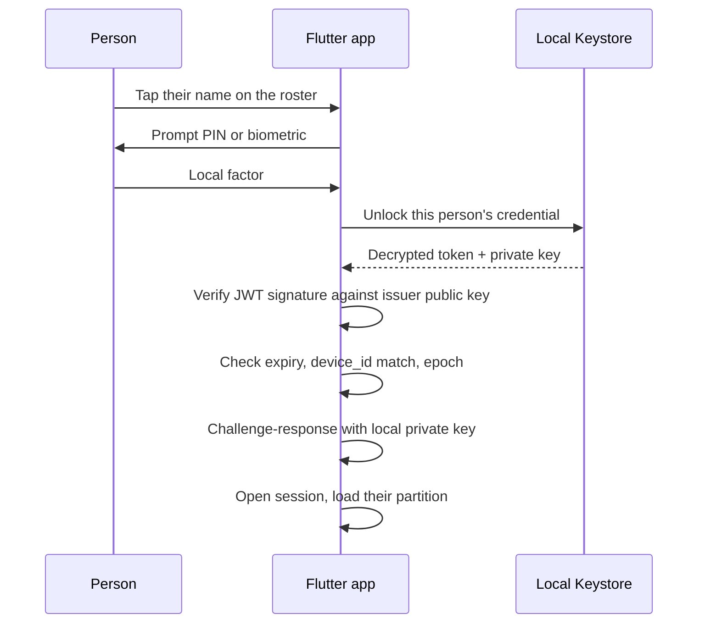

# Offline Sign-In Flow

The moment that actually has to work on a job site, a ward, a delivery route — wherever "unmanaged" and "offline" come from in the first place. No step in this flow touches the network.

## Steps in Detail

1. **Roster selection.** The roster itself is a locally cached list — no network needed to show it. See [[Multi-User Partitioning]].
2. **Local factor prompt.** PIN or biometric, scoped to that one profile on that one device.
3. **Unlock.** A correct local factor decrypts that person's stored token and private key. A wrong one doesn't — and repeated wrong attempts should trigger lockout (see [[../Security/Risk Register|Risk Register]]).
4. **Signature verification.** Pure local math: the issuer's public key ships baked into the app, so checking a token's signature never needs a network call.
5. **Expiry / device-id / epoch checks.** All three, every time — not a subset. See [[../Security/Token Lifecycle and Revocation|Token Lifecycle and Revocation]] for what each one is actually defending against.
6. **Challenge–response.** The app signs a fresh local nonce with the person's private key and verifies it against the stored public key. This is what stops a copied token blob from working on a device it wasn't issued to — possession of the token alone isn't enough, possession of the matching private key is required too.
7. **Session.** On success, a local session opens and that person's encrypted partition loads.

## What "Offline" Actually Means Here

Every one of the checks above runs entirely on-device. The only thing that ever required a network call was step zero of [[Enrollment Flow]] — proving identity to Cognito, at some point in the past, possibly days ago. Nothing in this flow can succeed or fail differently based on whether the device currently has signal.

## See Also

- [[Architecture Index]]
- [[Data Flow]] — this same flow as a concrete, step-by-step sequence against the real code, including the actual airplane-mode verification procedure
- [[System Diagram]] — the components-and-arrows version
- [[Enrollment Flow]]
- [[Multi-User Partitioning]]
- [[../Security/Trust Anchors|Trust Anchors]]
- [[../Security/Token Lifecycle and Revocation|Token Lifecycle and Revocation]]
