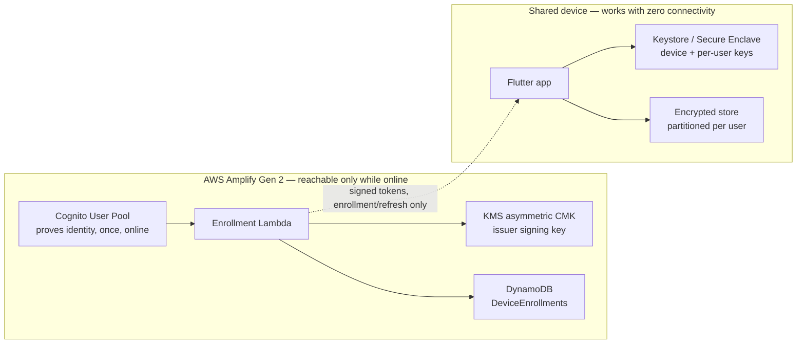

# System Overview

The cloud side of this system is only ever in the loop during enrollment and periodic refresh. It is never consulted at the moment someone signs in — that's the entire point. See [[../Management/The Actual Requirement|The Actual Requirement]] for why.

**The app's real entry point (Task 7) is the roster screen** — a local, on-device list of everyone already enrolled here, read from `RosterRegistryService` with no network call. Tapping a name prompts for that person's PIN and, on success, runs the offline sign-in flow below. "Add a person" is the one online-only action reachable from the roster, pushing the same Cognito sign-in / enrollment flow (`AuthGate` → `LoginScreen`) that used to be the app's forced front door through Task 6 — it's greyed out whenever the device has no connectivity, rather than left enabled to fail partway through. See [[System Diagram]] for the full box-and-arrow picture and [[Data Flow]] for the step-by-step sequence of each flow below.

## Roles

| Role | Lives where | Responsibility |
|---|---|---|
| Central identity service | Cloud, online-only | Confirms who someone is (Cognito), then mints signed offline capability tokens (Lambda + KMS) |
| Shared device | Offline-capable | Runs the app, holds a device keypair, holds an encrypted per-user local store |
| Person | Has a global identity in Cognito, plus one device-bound credential per device they're enrolled on | The thing actually being verified at sign-in |

Trust is anchored in three pieces of key material — see [[../Security/Trust Anchors|Trust Anchors]] for the full detail:

1. The issuer's public key (verifies tokens; baked into the app)
2. A per-device keypair (ties tokens to *this* hardware)
3. A per-user credential (bound to one person, on one device, gated by their own local factor)

## The Two Flows That Matter

- [[Enrollment Flow]] — happens online, once per person per device, and occasionally on refresh
- [[Offline Sign-In Flow]] — happens every time, and is the flow that has to work with no connectivity at all

## See Also

- [[Architecture Index]]
- [[System Diagram]] — the full box-and-arrow picture, including the roster/unlock flow
- [[Data Flow]] — the same flows, as step-by-step sequences
- [[../Security/Security Index|Security Index]]
